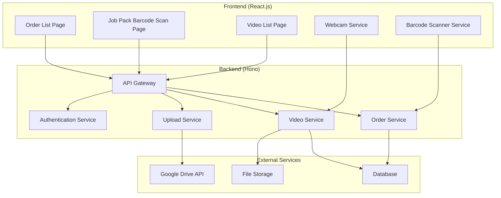

# Design Document

## Overview

The WMS Webcam Packing System is a full-stack web application built with React.js frontend and Hono backend. The system integrates webcam recording capabilities with barcode scanning, Google Drive storage, and real-time order management. The architecture follows a microservices approach with clear separation between frontend presentation, backend API services, and external integrations.

## Architecture

### System Architecture



### Technology Stack

**Frontend:**
- React.js 18+ with JavaScript
- React Router for navigation
- React Query for state management and API calls
- Material-UI or Tailwind CSS for styling
- WebRTC API for webcam access
- QuaggaJS or ZXing for barcode scanning

**Backend:**
- Hono framework with JavaScript
- JWT for authentication
- Prisma ORM for database operations
- Google Drive API v3 for file storage
- WebSocket for real-time updates

**Database:**
- PostgreSQL for production
- SQLite for development

## Components and Interfaces

### Frontend Components

#### OrderListPage Component
```typescript
interface Order {
  id: string;
  customerName: string;
  customerEmail: string;
  itemsCount: number;
  priority: 'high' | 'medium' | 'low';
  status: 'waiting' | 'in_progress' | 'completed';
  createdAt: Date;
}

interface OrderListPageProps {
  orders: Order[];
  onRefresh: () => void;
}
```

#### JobPackScanPage Component
```typescript
interface JobPackScanPageProps {
  onBarcodeScanned: (jobId: string) => void;
  onRecordingComplete: (videoBlob: Blob, jobId: string) => void;
}

interface WebcamRecorderState {
  isRecording: boolean;
  stream: MediaStream | null;
  mediaRecorder: MediaRecorder | null;
  recordedChunks: Blob[];
}
```

#### VideoListPage Component
```typescript
interface VideoRecord {
  id: string;
  jobId: string;
  fileName: string;
  driveFileId: string;
  shareableLink: string;
  recordedAt: Date;
  packerName: string;
  duration: number;
  uploadStatus: 'uploading' | 'completed' | 'failed';
}

interface VideoListPageProps {
  videos: VideoRecord[];
  onCopyLink: (link: string) => void;
}
```

### Backend API Interfaces

#### Order Management API
```typescript
// GET /api/orders
interface GetOrdersResponse {
  orders: Order[];
  total: number;
}

// PUT /api/orders/:id/status
interface UpdateOrderStatusRequest {
  status: 'waiting' | 'in_progress' | 'completed';
  packerId?: string;
}
```

#### Video Management API
```typescript
// POST /api/videos/upload
interface UploadVideoRequest {
  jobId: string;
  videoFile: File;
  packerId: string;
}

interface UploadVideoResponse {
  videoId: string;
  driveFileId: string;
  shareableLink: string;
}

// GET /api/videos
interface GetVideosResponse {
  videos: VideoRecord[];
  total: number;
}
```

#### Authentication API
```typescript
// POST /api/auth/login
interface LoginRequest {
  username: string;
  password: string;
}

interface LoginResponse {
  token: string;
  user: {
    id: string;
    username: string;
    role: 'packer' | 'manager' | 'admin';
  };
}
```

## Data Models

### Database Schema

```sql
-- Orders table
CREATE TABLE orders (
  id UUID PRIMARY KEY DEFAULT gen_random_uuid(),
  customer_name VARCHAR(255) NOT NULL,
  customer_email VARCHAR(255) NOT NULL,
  items_count INTEGER NOT NULL,
  priority VARCHAR(10) CHECK (priority IN ('high', 'medium', 'low')),
  status VARCHAR(20) CHECK (status IN ('waiting', 'in_progress', 'completed')),
  created_at TIMESTAMP DEFAULT CURRENT_TIMESTAMP,
  updated_at TIMESTAMP DEFAULT CURRENT_TIMESTAMP
);

-- Users table
CREATE TABLE users (
  id UUID PRIMARY KEY DEFAULT gen_random_uuid(),
  username VARCHAR(100) UNIQUE NOT NULL,
  password_hash VARCHAR(255) NOT NULL,
  role VARCHAR(20) CHECK (role IN ('packer', 'manager', 'admin')),
  created_at TIMESTAMP DEFAULT CURRENT_TIMESTAMP
);

-- Videos table
CREATE TABLE videos (
  id UUID PRIMARY KEY DEFAULT gen_random_uuid(),
  job_id VARCHAR(255) NOT NULL,
  file_name VARCHAR(255) NOT NULL,
  drive_file_id VARCHAR(255) NOT NULL,
  shareable_link TEXT NOT NULL,
  recorded_at TIMESTAMP DEFAULT CURRENT_TIMESTAMP,
  packer_id UUID REFERENCES users(id),
  duration INTEGER, -- in seconds
  upload_status VARCHAR(20) CHECK (upload_status IN ('uploading', 'completed', 'failed')),
  file_size BIGINT
);

-- Job packing sessions table
CREATE TABLE job_packing_sessions (
  id UUID PRIMARY KEY DEFAULT gen_random_uuid(),
  job_id VARCHAR(255) NOT NULL,
  order_id UUID REFERENCES orders(id),
  packer_id UUID REFERENCES users(id),
  started_at TIMESTAMP DEFAULT CURRENT_TIMESTAMP,
  completed_at TIMESTAMP,
  status VARCHAR(20) CHECK (status IN ('active', 'completed', 'cancelled'))
);
```

## Error Handling

### Frontend Error Handling
- **Network Errors:** Implement retry logic with exponential backoff
- **Webcam Access Denied:** Show permission request dialog with instructions
- **Barcode Scan Failures:** Provide manual job ID input fallback
- **Upload Failures:** Queue failed uploads for retry and show progress indicators

### Backend Error Handling
- **Google Drive API Errors:** Implement circuit breaker pattern and fallback storage
- **Database Connection Issues:** Use connection pooling and health checks
- **Authentication Failures:** Return appropriate HTTP status codes with clear messages
- **File Upload Errors:** Validate file types and sizes, handle storage quota limits

### Error Response Format
```typescript
interface ErrorResponse {
  error: {
    code: string;
    message: string;
    details?: any;
  };
  timestamp: string;
  requestId: string;
}
```

## Testing Strategy

### Frontend Testing
- **Unit Tests:** Jest and React Testing Library for component testing
- **Integration Tests:** Test webcam recording workflow and barcode scanning
- **E2E Tests:** Cypress for complete user workflows
- **Visual Regression Tests:** Chromatic for UI consistency

### Backend Testing
- **Unit Tests:** Vitest for service and utility function testing
- **Integration Tests:** Test database operations and external API integrations
- **API Tests:** Supertest for endpoint testing
- **Load Tests:** Artillery for performance testing under concurrent users

### Test Coverage Requirements
- Minimum 80% code coverage for critical paths
- 100% coverage for authentication and security functions
- Mock external services (Google Drive API) in tests
- Test error scenarios and edge cases

### Testing Environment Setup
```typescript
// Test configuration
interface TestConfig {
  database: {
    url: string; // Test database URL
    resetBetweenTests: boolean;
  };
  googleDrive: {
    mockEnabled: boolean;
    testFolderId: string;
  };
  webcam: {
    mockMediaStream: boolean;
  };
}
```

## Security Considerations

### Authentication & Authorization
- JWT tokens with short expiration times
- Role-based access control (RBAC)
- Secure password hashing with bcrypt
- Rate limiting on authentication endpoints

### Data Protection
- HTTPS enforcement for all communications
- Input validation and sanitization
- SQL injection prevention through parameterized queries
- XSS protection with Content Security Policy

### Google Drive Integration Security
- OAuth 2.0 for secure API access
- Scoped permissions (drive.file scope only)
- Secure storage of refresh tokens
- Regular token rotation

## Performance Optimization

### Frontend Optimization
- Code splitting and lazy loading for routes
- Video compression before upload
- Debounced barcode scanning to prevent duplicate scans
- Optimistic UI updates for better user experience

### Backend Optimization
- Database indexing on frequently queried fields
- Connection pooling for database connections
- Caching for frequently accessed data
- Streaming uploads for large video files

### Video Processing
- Client-side video compression using WebCodecs API
- Progressive upload with resumable uploads
- Thumbnail generation for video previews
- Automatic quality adjustment based on network conditions